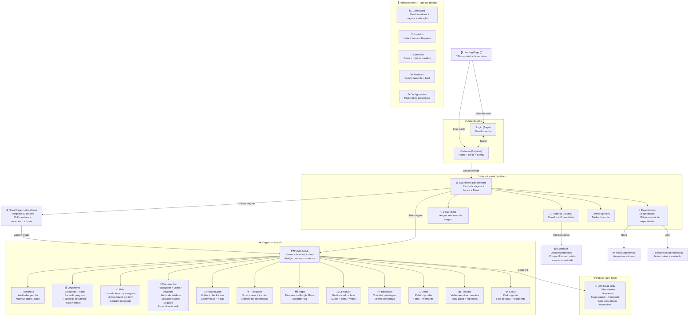

# RoteiroApp — Mapa do Site e Funcionalidades

> Abra este arquivo no VS Code com a extensão **Markdown Preview Mermaid Support** ou cole o conteúdo em [mermaid.live](https://mermaid.live) para visualizar o diagrama interativo.

---

## Fluxograma Geral



---

## Descrição de Cada Funcionalidade

### Acesso

| Tela | Caminho | O que faz |
|------|---------|-----------|
| **Landing Page** | `/` | Apresenta o app, lista de funcionalidades, contador dinâmico de usuários e CTA de cadastro |
| **Login** | `/login` | Autenticação com e-mail e senha |
| **Cadastro** | `/register` | Criação de conta com nome, e-mail e senha |

---

### Menu Lateral (disponível em todo o app)

| Menu | Caminho | O que faz |
|------|---------|-----------|
| **Dashboard** | `/dashboard` | Hub central: lista todas as suas viagens com filtros de status, busca por nome, e acesso rápido |
| **Roteiros** | `/routes` | Dois modos: **Curados** (selecionados pelo time) e **Comunidade** (publicados por usuários). Clonar um roteiro gera nova viagem automaticamente |
| **Dicas** | `/tips` | Artigos semanais sobre viagem — publicados toda segunda-feira. Inclui dicas da comunidade |
| **Experiências** | `/experiences` | Diário pessoal de experiências em viagens passadas: nota (0-10), fotos, avaliação e possibilidade de publicar como dica pública |
| **Perfil** | `/profile` | Editar nome, e-mail, senha e foto de perfil |

---

### Criar Viagem

| Tela | Caminho | O que faz |
|------|---------|-----------|
| **Nova Viagem** | `/trips/new` | Formulário completo: nome, múltiplos destinos, datas, orçamento, moeda, status e foto de capa. Oferece templates prontos (Mochilão Europa, Lua de Mel etc.) que pré-preenchem destinos e atividades sugeridas |

---

### Abas Dentro de uma Viagem (`/trips/[id]/...`)

| Aba | Caminho | O que faz |
|-----|---------|-----------|
| **Visão Geral** | `/trips/[id]` | Painel principal da viagem: destinos, datas, status, widget de clima, relógio dos fusos horários, alertas de imigração e botão de compartilhamento |
| **Itinerário** | `.../itinerary` | Lista de atividades organizadas por data e período do dia (Manhã / Tarde / Noite). Adicione, edite ou remova atividades com tipo, local e notas |
| **Orçamento** | `.../budget` | Registre despesas por categoria (transporte, alimentação, hospedagem…). Mostra total gasto, saldo e barra de progresso. Detecta despesas em moeda estrangeira e exibe parceiros de câmbio (Wise e Nomad) |
| **Mala** | `.../packing` | Lista de itens para embalar, organizados por categoria. Marque como embalado. Cada item ou categoria exibe link para o produto na Amazon. Itens de seguro viagem redirecionam para parceiros de seguro |
| **Documentos** | `.../documents` | Guarde informações de passaporte, vistos, reservas e vouchers. Alerta automático se o passaporte vence em menos de 6 meses. Parceiros de seguro viagem (Seguros Promo e Assistcard) exibidos com destaque quando não há seguro cadastrado |
| **Hospedagem** | `.../accommodation` | Registre hotéis e acomodações com check-in, check-out, confirmação e notas |
| **Transporte** | `.../transport` | Registre voos, trens e transfers com origem, destino, companhia, número de confirmação e horários |
| **Mapa** | `.../map` | Visualize todos os destinos da viagem no Google Maps. Botão para exportar/abrir a rota no Maps |
| **Comparar** | `.../compare` | Compare até dois destinos lado a lado: custo estimado, clima, exigência de visto e nota geral |
| **Preparação** | `.../prep` | Checklist pré-viagem com tarefas e prazo. Marque como concluído. Exemplos: renovar passaporte, contratar seguro, comprar adaptador |
| **Diário** | `.../journal` | Registre memórias dia a dia durante ou após a viagem: texto livre, fotos e avaliação do dia |
| **Resumo** | `.../summary` | Relatório executivo automático: total gasto, número de atividades, hospedagens, transportes e highlights da viagem |
| **Editar** | `.../edit` | Altere dados gerais: nome, destinos, datas, orçamento, moeda, status e foto de capa |

---

### Compartilhamento

| Recurso | Como funciona |
|---------|--------------|
| **Link Read-Only** | Em Visão Geral, clique em "Compartilhar". Um link público único é gerado (ex: `roteiroapp.com/share/abc123`). Quem receber pode ver itinerário, hospedagem e transporte — **sem ver dados financeiros**. Pode ser revogado a qualquer momento |

---

### Comunidade

| Tela | Caminho | O que faz |
|------|---------|-----------|
| **Roteiros da Comunidade** | `/routes` → aba Comunidade | Roteiros publicados por outros usuários. Filtre por destino ou tema. Clonar abre o formulário de nova viagem pré-preenchido |
| **Contribuir** | `/routes/contribute` | Publique seu roteiro para a comunidade após uma viagem |

---

### Admin (acesso restrito)

| Tela | Caminho | O que faz |
|------|---------|-----------|
| **Dashboard Admin** | `/admin` | KPIs: total de usuários, viagens criadas, taxa de retenção e usuários ativos nos últimos 7/30 dias |
| **Usuários** | `/admin/users` | Lista completa com busca, data de cadastro e ações de moderação |
| **Conteúdo** | `/admin/content` | Gerenciar dicas e roteiros curados publicados na plataforma |
| **Analytics** | `/admin/stats` | Comportamento dos usuários: quais funcionalidades são mais usadas, funil de criação de viagem |
| **Configurações** | `/admin/settings` | Parâmetros gerais do sistema |

---

## Fluxo de Uso Típico

```
1. Cadastro → Dashboard
2. "Nova Viagem" → preenche destinos + datas + orçamento
3. Itinerário → adiciona atividades por dia
4. Hospedagem → registra hotéis
5. Transporte → registra voos
6. Mala → monta lista de itens (links Amazon automáticos)
7. Documentos → confere passaporte + contrata seguro
8. Orçamento → registra gastos ao longo da viagem
9. Diário → escreve memórias durante a viagem
10. Resumo → vê relatório final
11. Compartilha → envia link read-only para amigos/família
```

---

*Gerado em 2026-05-25 — RoteiroApp v1.0*
